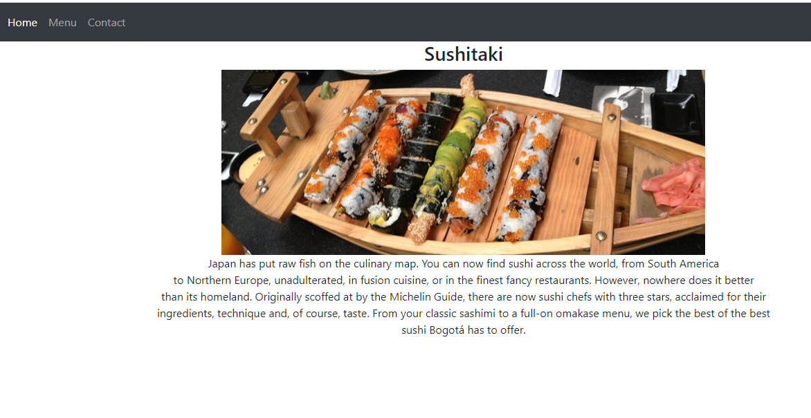

# Restaurant Project

Second JavaScript Microverse Project By Oscar Russi

# What it does

- The website was built with JavaScript and Webpack
- The page has a tab that allows the user to navigate through the three sections of the page: home, menu, and contact.
- When the page load it shows the content of the Home tab, it has a head, a paragraph with a short description of the restaurant, and an image.
- Tab Menu shows the list of food offered by the restaurant.
- Tab contact includes a form to send a message to the restaurant.
- Create a class for the food items.
- The project uses Bootstrap for styling.

# Build with

- HTML5/CSS
- JavaScript
- Webpack
- Bootstrap

# Live demo

[Live Demo](https://andresporras3423.github.io/restaurant/dist/index.html)

# How to run this project

- Download this project or install running the next command in the terminal: git clone https://github.com/andresporras3423/restaurant.git
- Move to the folder restaurant
- In the terminal, run: npx webpack
- Open in a browser the index.html file

#### and deployed to GitHub

## Authors

**Oscar Russi**
- Github: [@andresporras3423](https://github.com/andresporras3423/)
- Linkedin: [Oscar Russi](https://www.linkedin.com/in/oscar-andres-russi-porras)

## � Contributing

This is a project for educational purposes only. We are not accepting contributions.

## Attributions and Credit

Special thanks to Microverse, for this learning opportunity. 

## Show your support

Give a ⭐️ if you like this project!

## Enjoy!